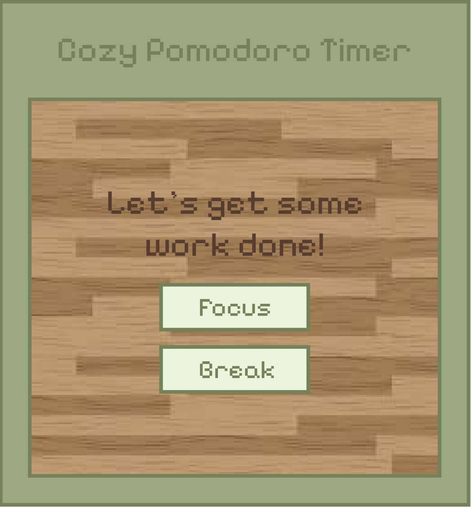

Matcha Pomodoro is a pixel art pomodoro timer desktop widget application. Built with HTML, CSS, JavaScript, and ElectronJS. Inspired by [@NashAllery](https://www.instagram.com/nashallery).



## Features

- Feature 1: [Short description]
- Feature 2: [Short description]
- Feature 3: [Short description]

---

## Installation (macOS)

Currently working on providing a prebuilt .dmg file. However, if you'd like run or build the app yourself, follow the steps below.

## Build from Source (Optional)

```bash
# Clone the repo:
   
git clone https://github.com/choaly/matcha-pomodoro.git
cd matcha-pomodoro

# Install dependencies:
npm install

# Run the app in development mode:
npm start

# Build the app for macOS:

npm run make

The packaged app will appear in the out/make/ folder.